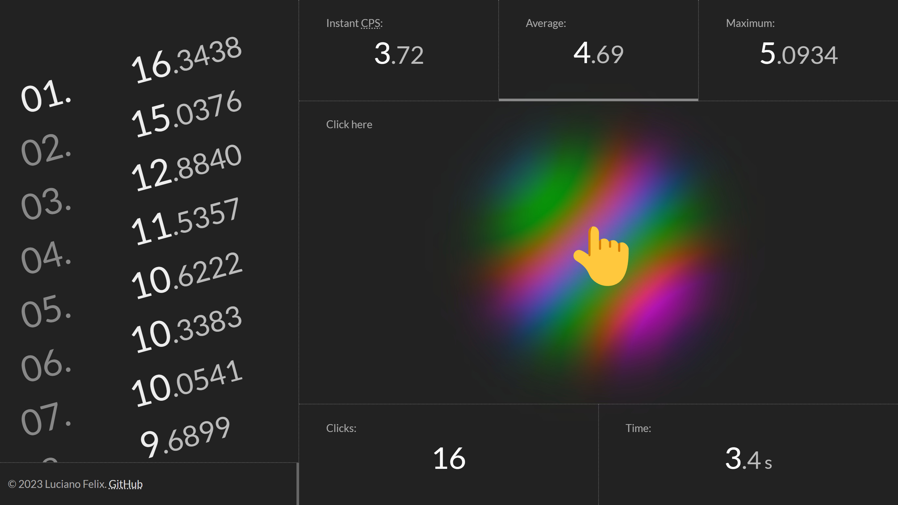

<!-- 

    

 -->

<h1 align="center">
    Click Speed test ⚡
</h1>

    Clicks-per-second meter with dynamic counting and auto reset.

    

 

## Features

The app features a dynamic counting system, which means that it continuously updates the clicks-per-second count as the user clicks in real-time. It also has an automatic reset feature, which clears the count after a certain amount of time has passed, allowing users to track their CPS over multiple sessions. The app also includes a rate history, that stores and displays the user's best clicking speed, allowing them to track their progress and see how their clicking speed has changed.

This app is useful if you want to improve your clicking speed and efficiency, and can be used for a variety of purposes such as gaming.

## Check it out

Here is the following link to [see it online](https://github.lucianofelix.com.br/clicks/).
It was made based on [this Pen at CodePen](https://codepen.io/FelixLuciano/pen/MWavXmy).

## License

This project is [MIT licensed](LICENSE)!
