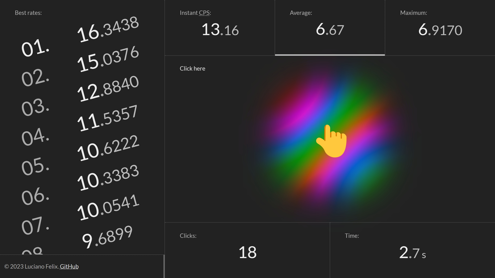

<!-- 

    

 -->

    <text x=%22-0.1em%22 y=%22.90em%22 font-size=%2286%22>⚡</text></svg>" width="128">

<h1 align="center">
    Click Speed test
</h1>

    Clicks-per-second meter with dynamic counting and auto reset.
     
    <strong><a href="https://github.lucianofelix.com.br/clicks/">See online</a></strong>

 

It's based on [my previous Pen at CodePen](https://codepen.io/FelixLuciano/pen/MWavXmy).

## License

This project is [MIT licensed](LICENSE)!
